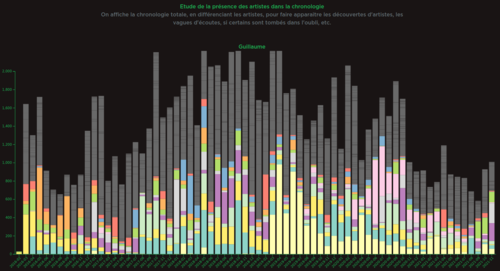

## Spotify Data Visualisation

page web : https://reathe.github.io/spotify-dataviz/

## Membres

- Guillaume Baulard
- Rafael Bachourian
- Florian Perreaut

## Résumé

Visualisation d'une étude des habitudes d'écoute de deux membres du trinôme, en termes d'artistes/albums/chansons/genres, mais aussi en termes temporels, à savoir répartition des écoutes dans le temps, en sessions, dans une journée type.

Variation dans les habitudes d'écoute :
- Beaucoup d'artistes & peu de chansons par artiste (large) vs. l'inverse (profond)
- Eclectique en genres musicaux ou plutôt chauvin. Présence des generes dans tous les artistes écoutés
- Taux de chansons populaires par artiste
- Popularité des artistes
- Différences liées au temps d'écoute :
    - taux d'écoute moyen par heure, détaillé
    - répartition des sessions dans le temps, en intervalles
- Etude de la présence des artistes dans la chronologie

## Summary

Visualization of a study of the listening habits of two members of the groupe of 3. Artists/albums/songs/genres, but also the distribution of the listens over time, divided in sessions, in a typical day.

Variations in listening habits :
- Many artists & few songs for each (wide) vs. the opposite (deep)
- Eclectic in musical genres or rather chauvinistic. Genre representation in all artists listened to
- Rate of popular songs listened to per artist
- Artist 
- Differences in listen time :
    - average listen time per hour in the day, detailed
    - distribution of listen sessions over time, in intervals
- Study of artist listen distribution over time as a chronology

## Liens

- https://lyondataviz.github.io/teaching/lyon1-m2/2021/projets.html#rendu
- https://lyondataviz.github.io/teaching/lyon1-m2/2021/
- https://www.univ-lyon1.fr/

## Sources

- https://observablehq.com/@d3/gallery
- https://www.d3-graph-gallery.com/
