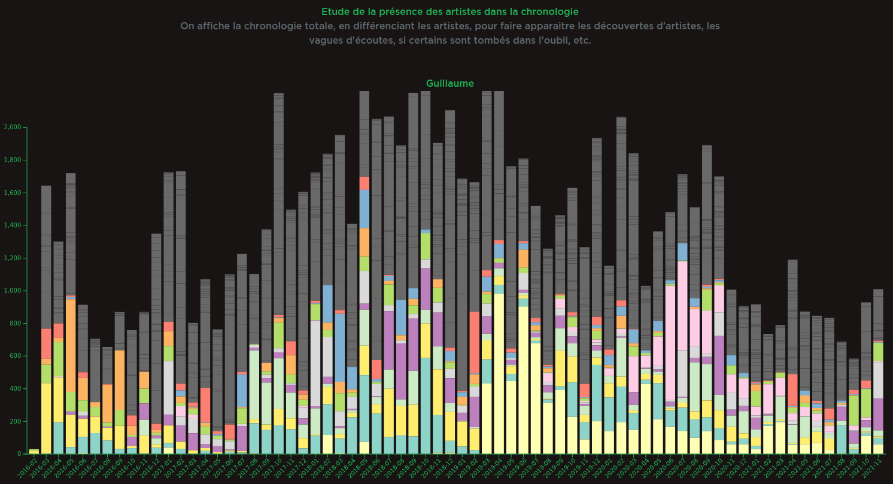

# Spotify Listening Habits: Data Visualization

> An interactive D3.js study comparing how two people listen to music, built from their complete Spotify
> streaming history: artists, genres, popularity and listening patterns over time.


### 🔗 [**View the live visualization**](https://reathe.github.io/spotify-dataviz/)



Data visualization project for the Master's course at Université Claude Bernard Lyon 1
([course page](https://lyondataviz.github.io/teaching/lyon1-m2/2021/)), by **Guillaume Baulard**,
**Rafael Bachourian** and **Florian Perreaut**. The page itself is in French.

## Questions explored

Each section compares two listeners (*Guillaume* and *Rafael*) side by side:

| Theme | Question | What is shown |
| --- | --- | --- |
| **Exploration vs. loyalty (artists)** | Many artists with few songs each (*wide*), or few artists explored in depth (*deep*)? | Totals of artists / albums / songs, average songs per artist |
| **Eclecticism (genres)** | Do the genres cover the whole musical spectrum, or do a few genres dominate? | Genre presence across all listened artists |
| **Hits vs. deep cuts** | Do we only play an artist's hits or explore their full catalogue? | Share of listened songs that are in each artist's global top 10 |
| **Mainstream vs. niche** | Do we follow the crowd? | Distribution of Spotify's 0–100 artist popularity index |
| **Time of day** | When do we listen? | Average listening time per hour of the day |
| **Listening sessions** | How long are our sessions and when do they happen? | Sessions (consecutive hours with plays) as intervals over the day |
| **Chronology** | When were artists discovered, binged, or forgotten? | Full listening timeline, coloured by artist |

## Data pipeline

```
Spotify "Extended streaming history" export (endsong_*.json)
        │  data_G/, data_R/
        ▼
Aggregation per listener (artists, albums, tracks, timestamps)
        │
        ▼
Enrichment with the Spotify Web API              ← data_final/spotify_search_requests.py
(artist genres, popularity index, top-10 tracks)
        │  data_final/*.json
        ▼
Pre-computed datasets for each chart             → graph_data/*.csv, *.json
        │
        ▼
D3.js v7 charts in a single static page          → index.html
```

## Running locally

The site is fully static, but D3 loads its data with `fetch`, so it must be served over HTTP rather than
opened as a file:

```bash
git clone https://github.com/Reathe/spotify-dataviz
cd spotify-dataviz
python -m http.server 8000
# then open http://localhost:8000
```

### Regenerating the enriched data (optional)

`data_final/spotify_search_requests.py` enriches the listening data with artist metadata from the
Spotify Web API. To run it, replace the `auth` variable with a valid
[Spotify access token](https://developer.spotify.com/documentation/web-api/concepts/access-token) and adjust
the input path at the bottom of the script.

## Project structure

```
.
├── index.html            # The visualization (layout, styles, D3 charts)
├── data_G/, data_R/      # Raw Spotify streaming history of each listener
├── data_final/           # Cleaned, aggregated & API-enriched data + enrichment script
├── graph_data/           # Datasets prepared for each chart
├── Esquisse*.{PNG,jpeg}  # Initial paper sketches of the design
└── Fonts/                # Gotham typeface used by the page
```

## Credits

- Course: [Lyon Data Viz, M2 2021](https://lyondataviz.github.io/teaching/lyon1-m2/2021/projets.html)
- Inspiration and examples: [D3 gallery](https://observablehq.com/@d3/gallery),
  [D3 Graph Gallery](https://www.d3-graph-gallery.com/)
